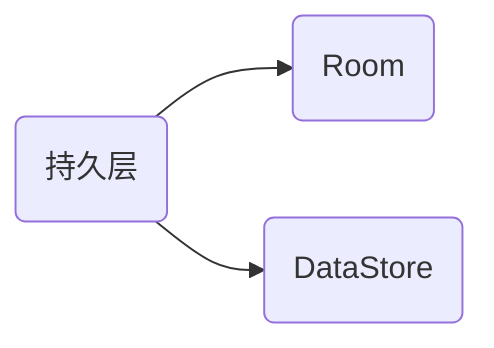
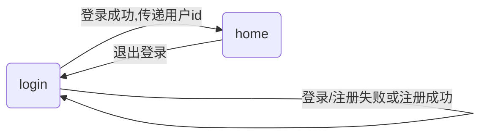
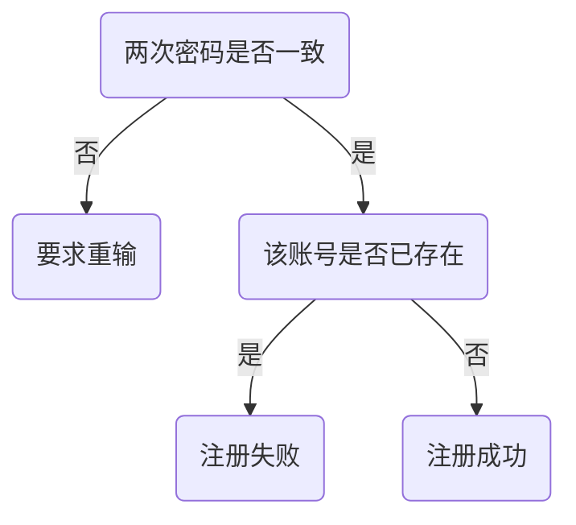

[toc]

# 一、关键词

‌‌‌　　持久层、依赖注入、Room、DataStore、数据流 Flow、Retrofit、okhttp、Navigation、ChatGPT、OpenAI、RestAPI、Kotlin、ViewModel、UI

# 二、应用分析

‌‌‌　　最开始想写这个应用时是打算采用老师在课堂上演示的[青云客的网络接口](http://api.qingyunke.com/),但是后来又找到了openAi官方开放的[接口](https://platform.openai.com/docs/introduction/overview),该接口所支持的案例比较丰富,具体可以参考[官方案例](https://platform.openai.com/examples),在了解了相关接口的调用方式以及对应参数的实际含义后,就开始着手开发.
‌‌‌　　由于是聊天应用,首先想到的便是类似于`微信`和`QQ`这样的聊天界面,同时在谷歌的开发者网站中的入门教程中也是将一个聊天页面作为入门级的教程的.其次 OpenAI 的官网中有很多案例,这些案例对应着请求接口时的不同参数,故我们的应用应当提供对应的自定义参数功能,以达到官网中的各种 案例要求.最后需要提供注册登录的功能,也就是说将用户的数据与登录的账号进行绑定.

# 三、功能介绍

##  1.与机器人智能聊天(核心)


## 2.支持用户自定义配置


## 3.数据持久化存储

## 4.支持登录注册功能
‌‌‌　　用户的数据将和注册的账号绑定存储在设备上

‌‌‌　　

## 5.分享功能
‌‌‌　　可将应用推荐给其他人使用
‌‌‌　　


# 四、应用架构

## 持久层



‌‌‌　　持久 层的作用主要就是保存用户的数据,包括用户与机器人对话的记录,用户注册时的信息以及相关联的配置项,当应用退出后再重新进入时,通过获取数据库中的数据,再加载到界面上,以实现数据"持久"存在的目的.

### Room
‌‌‌　　

#### 实体
1. Config(配置表)
2. Message(消息表)
3. User(用户表)


#### DAO (Data Access Object)数据访问对象

#### DataBase类

>   是一个数据库类，可为您的应用提供与该数据库关联的 DAO 实例。


### DataStore

> 在不需要存储关系型数据的情况下,DataStore Jetpack 组件非常适合存储简单的小型数据集，且开销较低。

‌‌‌　　在本应用中,通过` DataStore`存储应用的主题颜色以及字体大小的配置信息

## 网络层
‌‌‌　　

‌‌‌　　网络层使用`retrofit`对接口进行访问,获取对应的数据,再通过`gson`可以将得到的`json`数据转化为我们事先定义的对象
‌‌‌　　例如,我们定义该接口返回的对象如下
```kotlin
data class ChatResponse(
    val id: String,
    val created: Int,
    val model: String,
    val choices: List<Choice>,
    val usage: Usage
)
```

## 界面层

‌‌‌　　主要就是对各个界面的 UI 实现,这其中通过导航组件`Navigation`进行联系,实现多界面之间的跳转

## 视图层
‌‌‌　　主要保存界面中的 临时数据,防止`activity`生命周期变动时数据丢失的情况

# 五、核心功能实现

## 一、获取机器人回复
‌‌‌　　网络层使用的主要依赖是`retrofit`,在内存、速度和性能方面，对 Retrofit 对象调用 `create()` 函数的成本很高。该应用只需要一个 Retrofit API 服务实例，因此使用对象声明向应用的其余部分公开该服务。
```kotlin
  
private const val BASE_URL =  
    "https://api.openai.com/v1/"  
  
var httpBuilder = OkHttpClient.Builder()  
// 设置超时，超过 60s 视为超时  
var client = httpBuilder.readTimeout(60, TimeUnit.SECONDS)  
    .connectTimeout(60, TimeUnit.SECONDS)  
    .writeTimeout(60, TimeUnit.SECONDS)  
    .build()  
private val retrofit = Retrofit.Builder()  
    .addConverterFactory(GsonConverterFactory.create())  
    .baseUrl(BASE_URL)  
    .client(client)  
    .build()  
  
  
  
  
interface ChatApiService {  
    @Headers(  
        "Content-Type:application/json",  
        "Authorization:Bearer YOUR_KEY"  
    )  
    @POST("completions")  
    fun getRestaurants(@Body requestData: RequestBody): Call<ChatResponse>  
}  
  
object ChatApi {  
    val retrofitService: ChatApiService by lazy {  
        retrofit.create(ChatApiService::class.java)  
    }  
}
```
‌‌‌　　同时存在的一个问题是由于该接口的请求在某些时候可能耗时比较长,故我们需要将超时时间设置的长一些,否则默认的超时时长在`14s`左右,超过 14s 不会继续等待,我们需要将这个时间调整的长一些,`60s`可以满足绝大多数的请求

‌‌‌　　在`MainViewModel`中向接口请求数据,得到`AI`的回复
```kotlin
fun getAiReply(content: String) {  
    updateMessageUiState(content, true) // 将用户的输入进行记录  
    val requestBody = configUiState.toRequestBody(content)  
    restaurantsCall = ChatApi.retrofitService.getRestaurants(requestBody)  
    restaurantsCall.enqueue(  
        object : Callback<ChatResponse> {  
            override fun onResponse(  
                call: Call<ChatResponse>,  
                response: Response<ChatResponse>  
            ) {  
                response.body()?.choices?.get(0)?.let {  
                    viewModelScope.launch {  
                        val realTimeConfig =  
                            async { configRepository.getConfigByUserId(userId) }.await()  
                        if (realTimeConfig.id != 0) {  
                            // 使用最新的机器人名称  
                            configUiState =  
                                configUiState.copy(robotName = realTimeConfig.robotName)  
                        }  
                        updateMessageUiState(it.text.trim(), false)  
  
                    }  
  
                }            }  
  
            override fun onFailure(call: Call<ChatResponse>, t: Throwable) {  
                t.printStackTrace()  
                Log.e("MYTEST", "获取信息失败")  
            }  
        })  
}
```


## 二、聊天界面的构建

‌‌‌　　总体架构如下,主要是一个聊天消息列表和下面的输入框
```kotlin
@Composable  
fun ChatScreen(  
    viewModel: MainViewModel = viewModel(factory = AppViewModelProvider.Factory)  
) {  
  
    val listState = viewModel.listState  
    Surface() {  
        Box(modifier = Modifier.fillMaxSize()) {  
            Column(Modifier.fillMaxSize()) {  
                ChatDisplay(  
                    viewModel,  
                    modifier = Modifier.height(510.dp),  
                    listState = listState  
                )  
                UserInput(viewModel, listState)  
            }  
        }    }}
```

‌‌‌　　`ChatDisplay`定义如下,由于聊天消息是一个较长的列表,故我们采用的是`LazyColumn`组件
```kotlin
@Composable  
fun ChatDisplay(  
    viewModel: MainViewModel,  
    modifier: Modifier = Modifier,  
    listState: LazyListState  
) {  
    val chatUiState by viewModel.chatListState.collectAsState()  
  
    Surface(modifier = modifier) {  
        LazyColumn(  
            modifier = Modifier  
                .background(MaterialTheme.colors.background),  
            state = listState  
        ) {  
            items(chatUiState.chatList) { item ->  
                MessageItem(messageUiState = item.toMessageUiState())  
            }  
        }    }}
```

‌‌‌　　对于单个消息的展示函数`MessageItem`如下
```kotlin
@SuppressLint("SimpleDateFormat")  
@Composable  
fun MessageItem(messageUiState: MessageUiState) {  
    Row(  
        modifier = Modifier  
            .padding(all = 8.dp)  
    ) {  
        Image(  
            painter = painterResource(if (messageUiState.isSelf) R.drawable.user_avatar else R.drawable.robot_avatar),  
            contentDescription = null,  
            modifier = Modifier  
                .size(40.dp)  
                .clip(CircleShape)  
                .border(1.5.dp, MaterialTheme.colors.secondaryVariant, CircleShape)  
        )  
        Spacer(modifier = Modifier.width(8.dp))  
  
  
        Column {  
            Row {  
                Text(  
                    text = messageUiState.name,  
                    color = MaterialTheme.colors.secondaryVariant,  
                    style = MaterialTheme.typography.subtitle2  
                )  
                Spacer(modifier = Modifier.width(4.dp))  
                Text(  
                    text = messageUiState.dateStr,  
                    style = MaterialTheme.typography.subtitle2,  
                    fontWeight = FontWeight.Light,  
                    letterSpacing = 0.25.sp  
                )  
            }  
  
            Spacer(modifier = Modifier.height(4.dp))  
  
            Surface(  
                shape = MaterialTheme.shapes.medium,  
                elevation = 3.dp,  
                color = if (messageUiState.isSelf) MaterialTheme.colors.secondary else MaterialTheme.colors.surface,  
                modifier = Modifier  
                    .animateContentSize()  
                    .padding(1.dp)  
            ) {  
                SelectionContainer {  
                    Text(  
                        text = messageUiState.content,  
                        modifier = Modifier.padding(all = 4.dp),  
                        style = MaterialTheme.typography.body1  
                    )  
                }  
            }        }    }  
  
}
```

## 三、页面之间的导航处理

### Navigation 组件有三个主要部分：

‌‌‌　　-   **NavController**：负责在目标页面（即应用中的屏幕）之间导航。
‌‌‌　　-   **NavGraph**：用于映射要导航到的可组合项目标页面。
‌‌‌　　-   **NavHost**：此可组合项充当容器，用于显示 NavGraph 的当前目标页面。

‌‌‌　　首先我们在`MainActivity`中设置主组合函数`ChatRobotApp`,在主组合函数中
```kotlin
class MainActivity : ComponentActivity() {  
    @RequiresApi(Build.VERSION_CODES.O)  
    override fun onCreate(savedInstanceState: Bundle?) {  
        super.onCreate(savedInstanceState)  
        setContent {  
            ChatRobotTheme {
                Surface(  
                    modifier = Modifier.fillMaxSize(),  
                    color = MaterialTheme.colors.background  
                ) {  
                    ChatRobotApp()  
                }  
            }        }  
    }  
}
```
‌‌‌　　在`ChatRobotApp`中设置一个组合函数`ChatNavHost`,这里我们需要传入`navController`参数,后续的页面之间的导航都依赖于此参数
```kotlin
@Composable  
fun ChatRobotApp(navController: NavHostController = rememberNavController()){  
    ChatNavHost(navController = navController)  
}
```
‌‌‌　　`NavHost`组合项的参数如下
‌‌‌　　

‌‌‌　　我们在`ChatNavHost`组合项中对`NavHost`进行封装
```kotlin
@Composable  
fun ChatNavHost(  
    navController: NavHostController,  
    modifier: Modifier = Modifier,  
) {  
    NavHost(  
        navController = navController,  
        startDestination = "login"  
    ) {  
        composable(route = "login") {  
            LoginScreen(  
                navController = navController  
            )  
        }  
        composable(  
            route = "home/{userId}",  
            arguments = listOf(navArgument("userId") {  
                type = NavType.IntType  
            })  
        ) {  
            MainScreen(  
                navController = navController  
            )  
        }  
    }  
}
```

‌‌‌　　才上面的组合项中可以清晰地看出,我们的应用实际上只有两个页面,一个是登录页面`login`,一个是主界面`home`,这两个界面的主要关系如下


‌‌‌　　当用户在登录页面登录成功后,数据库会返回当前登录用户的id,在跳转到主界面`home`时会携带此参数,当加载主界面后,对应的`ViewModel`会以当前的用户`id`,去数据库中获取当前用户的数据,反映到界面上

## 四、登录注册逻辑的实现

### 1.注册
‌‌‌　　

‌‌‌　　首先,我们提供三个输入框,注册时由于**存在密码保护,为了防止用户输入有误**,我们要求用户输入两次密码,具体流程如下



‌‌‌　　对于注册功能中,需要注意的一点是,用户的**密码对安全性要求比较高**,因此我们将用户信息存入数据库时需要**对密码进行MD5加密处理 ^[ MD5加密概述，原理及实现-https://blog.csdn.net/Oliver_xpl/article/details/90214896]** ,`MD5`加密算法是一种**不可逆**的加密算法,就算后续数据库泄露,其他人得到的也只是加密后的用户密码,无法还原为明文.

‌‌‌　　注册按钮组件定义如下

```kotlin
Button(  
    modifier = modifier  
        .fillMaxWidth()  
        .weight(1f)  
        .padding(start = 8.dp),  
    onClick = {  
        loginViewModel.register(  
            infoAlert = { title: String, content: String ->  
                alertTitle = title  
                alertContent = content  
                showAlertDialog = !showAlertDialog  
            }  
        )  
    }  
) {  
    Text(  
        text = "注册",  
        style = MaterialTheme.typography.body2  
    )  
    if (showAlertDialog) {  
        ChatAlertDialog(  
            title = alertTitle,  
            content = alertContent,  
            onDismiss = { showAlertDialog = !showAlertDialog }  
        )  
    }  
}
```
‌‌‌　　该按钮的点击事件`onClick`调用对应的`viewModel`中的`register`函数,我们向`register`函数中传入的是一个`lambda`表达式,接受两个参数,分别是`title`和`content`,这分别代表着后续注册结果展示时的对话框的标题和内容
‌‌‌　　其中`showAlertDialog`代表着对话框的显示与否,其定义如下
```kotlin
var showAlertDialog by remember {  
    mutableStateOf(false)  
}
```

‌‌‌　　对应的`register`函数定义如下
```kotlin
fun register(  
    infoAlert: (String, String) -> Unit  
) {  
    if (isLoginValid()) {  
        if (loginUiState.password == loginUiState.passRepeat) {  
            viewModelScope.launch {  
                val isRepeat = async { userRepository.isExistSameAccount(loginUiState.account) }  
                if (!isRepeat.await()) {  
                    userRepository.insert(  
                        User(  
                            0,  
                            "用户",  
                            loginUiState.account,  
                            encode(loginUiState.password),  
                            "这个人很懒，没有签名"  
                        )  
                    )  
                    infoAlert("注册成功","直接登录即可开始使用")  
                } else {  
                    infoAlert("注册失败","当前账号已被使用")  
                }  
  
  
            }  
        } else {  
            infoAlert("输入有误","两次输入的密码不一致")  
        }  
  
    } else {  
        infoAlert("输入有误","没有输入两次密码或没有输入账号")  
    }  
  
}
```

### 2.登录

‌‌‌　　登录的逻辑和注册很像,其中一个特别的点便是,出于安全起见,在`OfflineUserRepository`中,对于登录时从服务器获取到的用户信息进行了加密处理
```kotlin
override suspend fun getUserByAccount(account: String, password: String): User {  
    val res = userDao.getUserByAccount(account, password)  
    // 如果查询不到对应的，则返回默认值  
    // 将返回的密码进行加密处理  
    return (res ?: User()).copy(password = "******")  
}
```
‌‌‌　　即将返回的用户信息中的密码替换为`******`,若根据用户输入的账号和密码在数据库中找不到对应的数据项,则`res`为`null`,此时将使用默认值`User()`,数据类`User`定义如下
```kotlin
@Entity(tableName = "user")  
data class User(  
    @PrimaryKey(autoGenerate = true)  
    val id: Int = 0,  
    val name: String = "游客", // 昵称  
    val account: String = "1234", // 账号，也是唯一的（和 id 的区别在于账号可以自己定义）  
    val password: String = "", // 密码，存入数据库前先进行 MD5加密  
    val description: String = "这个人很懒，什么都没有" // 个性说明  
)
```
## 五、持久层的实现

### Room
#### 1.Entity
‌‌‌　　实体代表着数据库中的一张表的内容,通过注解`@Entity`注明,后面的`tableName`代表该实体在数据库中对应的数据表的名称,若没有特别说明,则默认以实体类的名称作为表名
‌‌‌　　我们通过`@PrimaryKey`注解注定数据表的主键,`autoGenerate`表示`id`自增(需要设置初始值)
```kotlin
@Entity(tableName = "message")  
data class Message(  
    @PrimaryKey(autoGenerate = true)  
    val id: Int = 0, // id  
    val name: String, // 昵称  
    val time: Long, // 时间戳（秒级别）  
    val content: String, // 内容  
    @ColumnInfo(name = "user_id")  
    val userId: Int, // 对应的用户 Id    val isSelf: Boolean // 是否为用户，否则为 AI 回复  
)
```
‌‌‌　　由于数据库中命名规则和`kotlin`中的驼峰命名不太一致,为了兼容,我们可以使用`@ColumnInfo`注解指定数据类中某属性在数据表中对应的属性名
‌‌‌　　剩下的`配置表`和`用户表与此类似`
‌‌‌　　

#### 2. Dao
‌‌‌　　Dao 全称为**Data Access Object**,即数据访问对象,作用是通过提供抽象接口将持久性层与应用的其余部分分离。功能在于，让在底层持久性层执行数据库操作所涉及的所有复杂性与应用的其余部分分离。这样就可以独立于使用数据的代码更改数据层。

‌‌‌　　

‌‌‌　　我们以消息表对应的`MessageDao`为例,定义如下
```kotlin
@Dao  
interface MessageDao {  
  
    @Insert(onConflict = OnConflictStrategy.IGNORE)  
    suspend fun insert(message: Message)  
  
    @Query("SELECT * from message WHERE id = :id")  
    fun getMessage(id: Int): Flow<Message>  
  
    @Query("Select * from  message where user_id = :userId order by time asc")  
    fun getAllMessagesByUserId(userId: Int): Flow<List<Message>>  
  
}
```
‌‌‌　　我们用`@Dao`注解表明当前的接口是`Dao`,然后在其中写上对应的操作方法,对于比较基础常用的数据库操作方法,其只需通过简单的注解,如`@Insert`即可完成,若需要更加复杂的操作,则需要我们使用`@Query`注解,然后在对应的参数列表中传入原生`SQL`语句即可

#### 3. DataBase实例
‌‌‌　　它使用前面任务中的 `Entity` 和 `DAO`。数据库类定义了实体和 DAO 的列表。
‌‌‌　　可为应用提供定义的 DAO 实例。反过来，还可以使用 DAO 从数据库中检索数据，作为关联的数据实体对象的实例。
‌‌‌　　此外，应用还可以使用定义的数据实体更新相应表中的行，或者创建新行供插入。
‌‌‌　　获取 `RoomDatabase` 实例的一般过程如下^[https://developer.android.com/codelabs/basic-android-kotlin-compose-persisting-data-room]:
‌‌‌　　-   创建一个扩展 `RoomDatabase` 的 `public abstract` 类。您定义的新抽象类将用作数据库持有者。您定义的类是抽象类，因为 `Room` 会为您创建实现。
‌‌‌　　-   为该类添加 `@Database` 注解。在参数中，为数据库列出实体并设置版本号。
‌‌‌　　-   定义一个返回 `ItemDao` 实例的抽象方法或属性，`Room` 会为您生成实现。
‌‌‌　　-   整个应用只需要一个 `RoomDatabase` 实例，因此请将 `RoomDatabase` 设为单例。
‌‌‌　　-   使用 `Room` 的 [`Room.databaseBuilder`](https://developer.android.com/reference/androidx/room/Room?hl=zh-cn#databaseBuilder(android.content.Context,java.lang.Class,kotlin.String)) 创建 (`item_database`) 数据库。不过，仅当该数据库不存在时才应创建。否则，请返回现有数据库。

‌‌‌　　与前面的定义类似,这里我们需要使用`@Database`注解

>在 `companion` 对象内，为数据库声明一个私有的可为 null 变量 `Instance`，并将其初始化为 `null`。`Instance` 变量将在数据库创建后保留对数据库的引用。这有助于保持在任意时间点都只有一个打开的数据库实例，因为这种资源的创建和维护成本极高。
‌‌‌　　`@Volatile`注解的变量的值绝不会缓存,所有读写操作都将在主内存中完成。这些功能有助于确保 `Instance` 的值始终是最新的，并且对所有执行线程都相同。也就是说，一个线程对 `Instance` 所做的更改会立即对所有其他线程可见^[https://developer.android.com/codelabs/basic-android-kotlin-compose-persisting-data-room]。

‌‌‌　　多个线程可能会同时请求数据库实例，导致产生两个数据库，而不是一个。此问题称为[竞态条件](https://en.wikipedia.org/wiki/Race_condition)。封装代码以在 `synchronized` 块内获取数据库意味着一次只有一个执行线程可以进入此代码块，从而确保数据库仅初始化一次。

‌‌‌　　定义如下:

```kotlin
@Database(  
    entities = [Message::class, User::class, Config::class],  
    version = 7,  
    exportSchema = false  
)  
abstract class ChatDb : RoomDatabase() {  
    abstract val messageDao: MessageDao  
    abstract val userDao: UserDao  
    abstract val configDao: ConfigDao  
  
    companion object {  
        @Volatile  
        private var Instance: ChatDb? = null  
        fun getDatabase(context: Context): ChatDb {  
            return Instance ?: synchronized(this) {  
                Room.databaseBuilder(context, ChatDb::class.java, "item_database")  
                    .fallbackToDestructiveMigration()  
                    .build()  
                    .also { Instance = it }  
            }        }  
    }  
}
```


‌‌‌　　最终生成的数据库如下所示
‌‌‌　　

#### 4.存储库

‌‌‌　　存储库基本是对 `Dao`层的再次封装,因为 `Dao`获取到的数据是直接从数据库请求的,有时我们需要对这个原生的数据进一步处理
‌‌‌　　这里处于框架设计的理念,我们是先定义一个接口,在里面定义所要实现的方法,例如接口`MessageRepository`
```kotlin
interface MessageRepository {  
  
    fun getMessagesStreamByUserId(userId: Int): Flow<List<Message>>  
  
    suspend fun insertMessage(message: Message)  
  
  
}
```

‌‌‌　　然后在具体的具体的`OfflineMessageRepository`实现接口中的方法

```kotlin
class OfflineMessageRepository(private val messageDao: MessageDao) : MessageRepository {  
    override fun getMessagesStreamByUserId(userId: Int): Flow<List<Message>> =  
        messageDao.getAllMessagesByUserId(userId)  
  
    override suspend fun insertMessage(message: Message) = messageDao.insert(message)  
}
```


### DataStore

> SQL 和 Room 是功能强大的工具。但是，在您不需要存储关系型数据的情况下，DataStore 可以提供一个简单的解决方案。DataStore Jetpack 组件非常适合存储简单的小型数据集，且开销较低。DataStore 有两种不同的实现：`Preferences DataStore` 和 `Proto DataStore`^[https://developer.android.com/codelabs/basic-android-kotlin-compose-datastore]。

‌‌‌　　在本应用中,我们通过 `DataStore`存储应用的主题颜色以及对应的字体大小,由于只需要存储简单的键值对,故我们只需要使用`Preferences DataStore`

‌‌‌　　同`Room`操作类似,我们需要建立一个`DataStore`的存储库`UserPreferencesRepository`,可以注意到该类接受一个参数`dataStore`,这就是我们后面要提到的`依赖注入`的方式

```kotlin
class UserPreferencesRepository(  
    private val dataStore: DataStore<Preferences>  
) {  
    private companion object {  
        val IS_DARK_THEME = booleanPreferencesKey("is_dark_theme")  
        val FONT_SIZE = stringPreferencesKey("font_size")  
        const val TAG = "UserPreferencesRepo"  
    }  
  
    val themeConfig: Flow<Boolean> = dataStore.data  
        .catch {  
            if (it is IOException) {  
                Log.e(TAG, "Error reading preferences.", it)  
                emit(emptyPreferences())  
            } else {  
                throw it  
            }  
        }  
        .map { preferences ->  
            preferences[IS_DARK_THEME] ?: false  
        }  
  
    val fontConfig: Flow<String> = dataStore.data  
        .catch {  
            if (it is IOException) {  
                Log.e(TAG, "Error reading preferences.", it)  
                emit(emptyPreferences())  
            } else {  
                throw it  
            }  
        }  
        .map { preferences ->  
            preferences[FONT_SIZE] ?: "小"  
        }  
  
    suspend fun saveUserPreference(value: Boolean) {  
        dataStore.edit { preferences ->  
            preferences[IS_DARK_THEME] = value  
        }  
    }  
  
    suspend fun saveUserFontPreference(value: String) {  
        dataStore.edit { preferences ->  
            preferences[FONT_SIZE] = value  
        }  
    }  
}
```


## 六、依赖注入

### 什么是依赖项注入^[https://developer.android.com/training/dependency-injection?hl=zh-cn]?
‌‌‌　　类通常需要引用其他类。例如，`Car` 类可能需要引用 `Engine` 类。这些必需类称为依赖项，在此示例中，`Car` 类依赖于拥有 `Engine` 类的一个实例才能运行。

‌‌‌　　类可通过以下三种方式获取所需的对象：

1.  类构造其所需的依赖项。在以上示例中，`Car` 将创建并初始化自己的 `Engine` 实例。
2.  从其他地方抓取。某些 Android API（如 `Context` getter 和 `getSystemService()`）的工作原理便是如此。
3.  以参数形式提供。应用可以在构造类时提供这些依赖项，或者将这些依赖项传入需要各个依赖项的函数。在以上示例中，`Car` 构造函数将接收 `Engine` 作为参数。

‌‌‌　　第三种方式就是依赖项注入！使用这种方法，您可以获取并提供类的依赖项，而不必让类实例自行获取。
‌‌‌　　下面是一个示例。在不使用依赖项注入的情况下，要表示 `Car` 创建自己的 `Engine` 依赖项，代码如下所示：
```kotlin
‌‌‌class Car {  
    private val engine = Engine()  
    fun start() {  
        engine.start()  
    }  
}  
  
fun main(args: Array) {  
    val car = Car()  
    car.start()  
}
```
‌‌‌　　这并非依赖项注入的示例，因为 `Car` 类构造了自己的 `Engine`。这可能会有问题，原因如下：

‌‌‌　　-   `Car` 和 `Engine` 密切相关 - `Car` 的实例使用一种类型的 `Engine`，并且无法轻松使用子类或替代实现。如果 `Car` 要构造自己的 `Engine`，您必须创建两种类型的 `Car`，而不是直接将同一 `Car` 重用于 `Gas` 和 `Electric` 类型的引擎。
‌‌‌　　-   对 `Engine` 的强依赖使得测试更加困难。`Car` 使用 `Engine` 的真实实例，因此无法使用[测试替身](https://en.wikipedia.org/wiki/Test_double)针对不同的测试用例修改 `Engine`。

### 具体实现

‌‌‌　　从前面的`OfflineMessageRepository`中我们就会发现,该类接受一个`messageDao`的参数,同理后面的`ViewModel`中访问数据库,我们也需要对应的`Repository`实例,在本项目中我们采用的是`依赖注入`的方式
‌‌‌　　我们实现 `AppContainer` 类,它将实例化数据库并将 `DAO `实例传递给 `OfflineItemsRepository` 类

```kotlin
interface AppContainer {  
    val messageRepository: MessageRepository  
    val userRepository: UserRepository  
    val configRepository: ConfigRepository  
}  
  
class AppDataContainer(private val context: Context) : AppContainer {  
    /**  
     * Implementation for [ItemsRepository]  
     */  
    override val messageRepository: MessageRepository by lazy {  
        OfflineMessageRepository(ChatDb.getDatabase(context).messageDao)  
    }  
    override val userRepository: UserRepository by lazy {  
        OfflineUserRepository(ChatDb.getDatabase((context)).userDao)  
    }  
  
    override val configRepository: ConfigRepository by lazy {  
        OfflineConfigRepository(ChatDb.getDatabase(context).configDao)  
    }  
}
```

‌‌‌　　在`AppViewModelProvider`将存储库传递给`ViewModel`,即我们前面提到的`依赖注入`,这样可以实现对象的复用

```kotlin
object AppViewModelProvider {  
    val Factory = viewModelFactory {  
        initializer {  
            MainViewModel(  
                this.createSavedStateHandle(),  
                chatApplication().container.messageRepository,  
                chatApplication().container.userRepository,  
                chatApplication().container.configRepository  
            )  
        }  
        initializer {  
            LoginViewModel(  
                chatApplication().container.userRepository,  
                chatApplication().userPreferencesRepository,  
            )  
        }  
        initializer {  
            ConfigViewModel(  
                this.createSavedStateHandle(),  
                chatApplication().userPreferencesRepository,  
                chatApplication().container.configRepository,  
                chatApplication().container.userRepository  
  
            )  
        }  
  
    }}  
  fun CreationExtras.chatApplication(): ChatApplication =  
    (this[ViewModelProvider.AndroidViewModelFactory.APPLICATION_KEY] as ChatApplication)
```

‌‌‌　　其中`ChatApplication`定义如下,其中我们定义了两个变量,一个是`container`用于数据库实例的注入,`userPreferencesRepository`则是用于`DataStore`的注入
```kotlin
private const val USER_PREFERENCE_NAME = "user_preferences"  
private val Context.dataStore: DataStore<Preferences> by preferencesDataStore(  
    name = USER_PREFERENCE_NAME  
)  
  
class ChatApplication : Application() {  
    lateinit var userPreferencesRepository: UserPreferencesRepository  
    lateinit var container: AppContainer  
    override fun onCreate() {  
        super.onCreate()  
        container = AppDataContainer(this)  
        userPreferencesRepository = UserPreferencesRepository(dataStore)  
    }  
  
}
```

‌‌‌　　需要在`AndroidManifest.xml`配置文件对其进行注册,此方法将 `ChatApplication` 类定义为应用的入口点。此代码用于在启动 `MainActivity` 之前，初始化 `ChatApplication` 类中定义的依赖项。
‌‌‌　　


‌‌‌　　后续在`ViewModel`中若需要访问存储库,我们只需要在`ViewModel`中传入对应的实例,例如`MainViewModel`中
```kotlin
class MainViewModel(  
    savedStateHandle: SavedStateHandle,  
    private val messageRepository: MessageRepository,  
    private val userRepository: UserRepository,  
    private val configRepository: ConfigRepository  
) : ViewModel() {

......
......
}
```

‌‌‌　　我们在前面提到的`AppViewModelProvider`文件中向`ViewModel`中传入对应的实例

## 七、数据流(Flow)的实现

> 在协程中，与仅返回单个值的挂起函数相反，数据流可按顺序发出多个值。例如，您可以使用数据流从数据库接收实时更新。
> 数据流以协程为基础构建，可提供多个值。从概念上来讲，数据流是可通过异步方式进行计算处理的一组数据序列。所发出值的类型必须相同。例如，`Flow<Int>` 是发出整数值的数据流。
> 数据流与生成一组序列值的 `Iterator` 非常相似，但它使用挂起函数通过异步方式生成和使用值。这就是说，例如，数据流可安全地发出网络请求以生成下一个值，而不会阻塞主线程。


‌‌‌　　数据流包含三个实体：

‌‌‌　　-   **生产者(producer)** 会生成添加到数据流中的数据。得益于协程，数据流还可以异步生成数据。
‌‌‌　　-   **（可选）中介(Intermediaries)** 可以修改发送到数据流的值，或修正数据流本身。
‌‌‌　　-   **消费者(consumer)** 则使用数据流中的值。

‌‌‌　　

‌‌‌　　在本项目中数据流主要是用在从持久层中获取数据,由于持久层中的数据在应用内配置项发生改变时是会变动的,这种变动我们需要及时的推送到应用界面,使界面上显示的数据发生改变.

‌‌‌　　在持久性层中使用 `Flow`。将返回值类型设为 `Flow` 后，只要数据库中的数据发生更改，就会收到通知。`Room` 会为保持更新此 `Flow`，也就是说，只需要显式获取一次数据。由于返回值类型为 `Flow`，Room 还会在后台线程上运行该查询。**无需将其明确设为 `suspend` 函数并在协程作用域内进行调用**。

‌‌‌　　这里我们以用户的消息列表为例进行演示
‌‌‌　　在`OfflineMessageRepository`中我们对`getMessagesStreamByUserId`进行重写,调用`messageDao`中的`getAllMessagesByUserId`方法

```kotlin
‌‌‌　override fun getMessagesStreamByUserId(userId: Int): Flow<List<Message>> =  
    messageDao.getAllMessagesByUserId(userId)
```
‌‌‌　　该方法在`dao`中定义如下(根据用户id获取聊天记录 并按时间升序排列)
```kotlin
‌‌‌　@Query("Select * from  message where user_id = :userId order by time asc")  
‌‌‌　fun getAllMessagesByUserId(userId: Int): Flow<List<Message>>
```
‌‌‌　　我们在`ViewModel`中使用该方法返回的数据
```kotlin
val chatListState: StateFlow<ChatUiState> =  
    messageRepository.getMessagesStreamByUserId(userId)  
        .filterNotNull()  
        .map { ChatUiState(it) }  
        .stateIn(  
            scope = viewModelScope,  
            started = SharingStarted.WhileSubscribed(TIMEOUT_MILLIS),  
            initialValue = ChatUiState()  
        )
```
‌‌‌　　上面的这个数据定义方式中:`filterNotNull`是为了过滤掉空数据,`map`则是为了将数据库中获取的`List<Message>`类型转化为`ChatUiState`类型,`stateIn`则是将`Flow`转化为`StateFlow`,以便界面上数据能够被追踪状态的变化
‌‌‌　　在界面的组合项函数中,若想访问`ViewModel`中定义的数据流,只需如下定义
```kotlin
‌‌‌val chatUiState by viewModel.chatListState.collectAsState()
```

## 八、主题的切换

‌‌‌　　本应用支持用户手动切换为深色模式以及调整应用内全局的字体大小，并且这种改变是持久的，即用户退出软件后再重新进入时之前的配置依然是生效的。
‌‌‌　　观察`MainActivity`中我们会发现在渲染界面之前是设置了对应的主题的,例如本应用的主题为`ChatRobotTheme`
```kotlin
class MainActivity : ComponentActivity() {  
    @RequiresApi(Build.VERSION_CODES.O)  
    override fun onCreate(savedInstanceState: Bundle?) {  
        super.onCreate(savedInstanceState)  
        setContent {  
            ChatRobotTheme {  
                Surface(  
                    modifier = Modifier.fillMaxSize(),  
                    color = MaterialTheme.colors.background  
                ) {  
                    ChatRobotApp()  
                }  
            }        }  
    }  
}
```

‌‌‌　　在`ChatRobotTheme`中,我们从`LoginViewModel` 中获取用户的配置信息,这些配置信息是通过`DataStore`存储在设备上的,并且以数据流`Flow`的形式获取,这样当用户在应用内改变配置后,这些配置项就会立即生效
```kotlin
@Composable  
fun ChatRobotTheme(  
    loginViewModel: LoginViewModel = viewModel(factory = AppViewModelProvider.Factory),  
    content: @Composable () -> Unit  
) {  
    val themeState = loginViewModel.themeState.collectAsState().value  
    val fontState = loginViewModel.fontState.collectAsState().value  
    val colors = if (themeState) DarkColorPalette else LightColorPalette  
    val fontTypography = when (fontState) {  
        "小" -> TypographySmall  
        "中" -> TypographyMedium  
        "大" -> TypographyLarge  
        else -> TypographySmall  
    }  
    MaterialTheme(  
        colors = colors,  
        typography = fontTypography,  
        shapes = Shapes,  
        content = content  
    )  
}
```
‌‌‌　　在`Type.kt`文件中,我们定义了三套字体风格,主要是针对字体大小的,根据用户的配置,应用会自动匹配三种字体主题,从而实现自定义字体大小的功能
```kotlin
val TypographySmall = Typography(  
    h5 = TextStyle(  
        fontWeight = FontWeight.Normal,  
        fontSize = 20.sp,  
        letterSpacing = 0.sp  
    ),  
    body1 = TextStyle(  
        fontFamily = FontFamily.Default,  
        fontWeight = FontWeight.Normal,  
        fontSize = 16.sp  
    ),  
    body2 = TextStyle(  
        fontWeight = FontWeight.Normal,  
        fontSize = 14.sp,  
        letterSpacing = 0.25.sp  
    ),  
    subtitle2 = TextStyle(  
        fontWeight = FontWeight.Medium,  
        fontSize = 14.sp,  
        letterSpacing = 0.1.sp  
    ),   
)
```

‌‌‌　　同理通过获取的`themeState`变量来控制主题颜色

# 六、不足之处

1. 该官方接口还支持根据用户描述生成图片,但是目前本项目没有集成这个接口;
2. 用户输入后,等待机器人回复时没有对应的等待动画,体验不是很友好;
3. 当用户聊天内容较多后,翻看聊天记录比较麻烦;
4. 暂不支持定义背景图,用户头像等操作;
5. 没有记住用户的登录状态,每一次使用前都需要重新登陆;


# 七、相关链接

## 本项目
> 本项目已开源在gitee平台
-  [ChatRobot-Gitee](https://gitee.com/jdysya/chatRobot)
> 发行版应用链接,可以在此处获取最新版
- [ChatRobot-release](https://gitee.com/jdysya/chatRobot/releases)

## 相关的开源项目

> 数据库持久层参考项目
- [basic-android-kotlin-compose-training-inventory-app](https://github.com/google-developer-training/basic-android-kotlin-compose-training-inventory-app)
> DataStore参考项目
-  [basic-android-kotlin-compose-training-dessert-release](https://github.com/google-developer-training/basic-android-kotlin-compose-training-dessert-release/tree/main)
> 各种组件的参考项目
-  [Jetpack-Compose-Tutorials](https://github.com/SmartToolFactory/Jetpack-Compose-Tutorials)
> 导航组件的使用案例
- [basic-android-kotlin-compose-training-cupcake](https://github.com/google-developer-training/basic-android-kotlin-compose-training-cupcake/tree/navigation)
> 网络请求相关的参考
- [Kickstart-Modern-Android-Development-with-Jetpack-and-Kotlin 书籍配套代码](https://github.com/PacktPublishing/Kickstart-Modern-Android-Development-with-Jetpack-and-Kotlin)
- [basic-android-kotlin-compose-training-mars-photos](https://github.com/google-developer-training/basic-android-kotlin-compose-training-mars-photos)

## 相关的教程
> 官方的compose入门教程，很详细，面面俱到
- [Android Basics with Compose](https://developer.android.com/courses/android-basics-compose/course)
> 和compose相关的书籍,也是很详细
- [Kickstart-Modern-Android-Development-with-Jetpack-and-Kotlin书籍](https://www.packtpub.com/product/kickstart-modern-android-development-with-jetpack-and-kotlin/9781801811071)
- [Jetpack Compose by Tutorials](raywenderlich.com)
> 官方的入门课程,就是做一个聊天界面,本应用受此启发
- [官方的入门课程](https://developer.android.google.cn/jetpack/compose/tutorial?hl=zh-cn)
> MD5 加密算法比较详细的解析
- [MD5 加密算法](https://blog.csdn.net/Oliver_xpl/article/details/90214896)
> 本应用中机器人采用的接口
- [OpenAI API](https://beta.openai.com/docs/introduction/overview)
-  [Material中的字体样式Typography](https://material-components.github.io/material-components-web-catalog/#/component/typography)